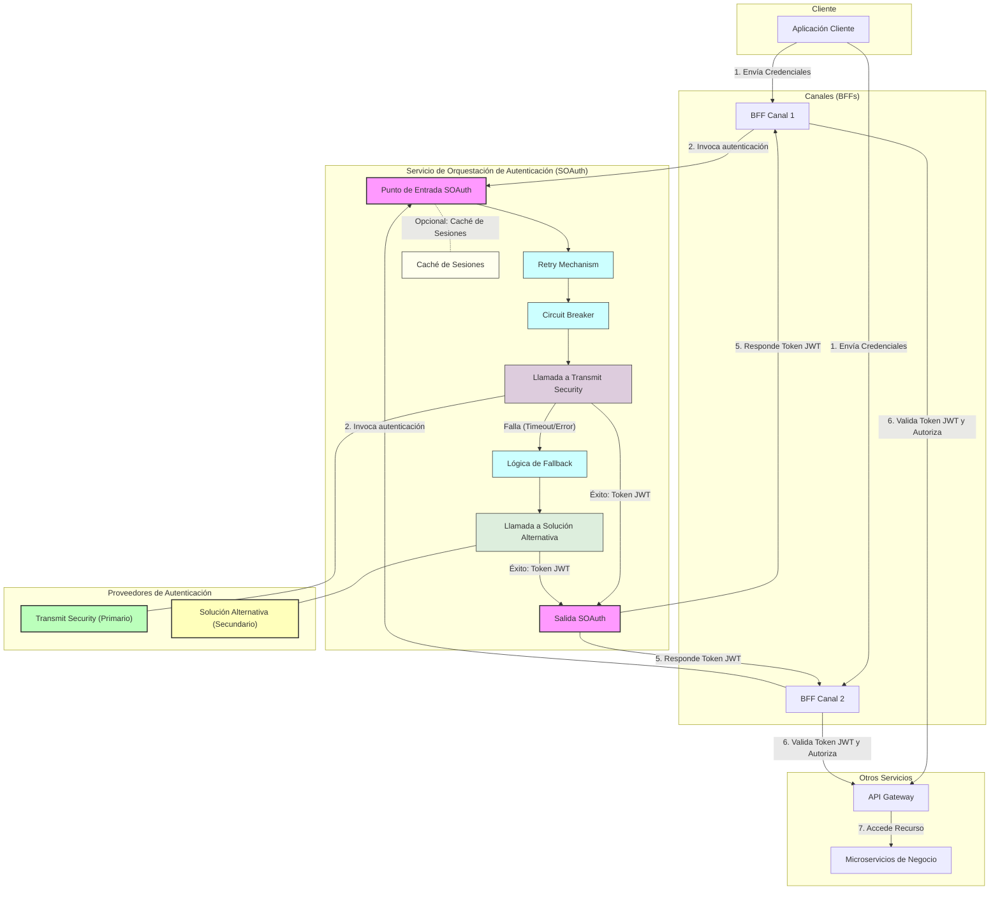

```mermaid
graph TD
    subgraph Cliente
        A[Aplicación Cliente]
    end

    subgraph "Canales (BFFs)"
        BFF1[BFF Canal 1]
        BFF2[BFF Canal 2]
    end

    subgraph "Servicio de Orquestación de Autenticación (SOAuth)"
        direction LR
        TSCall[Llamada a Transmit Security]
        AltCall[Llamada a Solución Alternativa]

        SOAuth_Entry[Punto de Entrada SOAuth] --> R[Retry Mechanism]
        R --> CB[Circuit Breaker]
        CB --> TSCall

        TSCall -- "Éxito: Token JWT" --> SOAuth_Exit[Salida SOAuth]
        TSCall -- "Falla (Timeout/Error)" --> FallbackLogic[Lógica de Fallback]

        FallbackLogic --> AltCall
        AltCall -- "Éxito: Token JWT" --> SOAuth_Exit

        SOAuth_Entry -. Opcional: Caché de Sesiones .- Cache[Caché de Sesiones]
    end

    subgraph "Proveedores de Autenticación"
        TS["Transmit Security (Primario)"]
        SA["Solución Alternativa (Secundario)"]
    end

    subgraph Otros Servicios
        AG["API Gateway"]
        MS["Microservicios de Negocio"]
    end

    A -- "1. Envía Credenciales" --> BFF1
    A -- "1. Envía Credenciales" --> BFF2

    BFF1 -- "2. Invoca autenticación" --> SOAuth_Entry
    BFF2 -- "2. Invoca autenticación" --> SOAuth_Entry

    TSCall --- TS
    AltCall --- SA

    SOAuth_Exit -- "5. Responde Token JWT" --> BFF1
    SOAuth_Exit -- "5. Responde Token JWT" --> BFF2

    BFF1 -- "6. Valida Token JWT y Autoriza" --> AG
    BFF2 -- "6. Valida Token JWT y Autoriza" --> AG

    AG -- "7. Accede Recurso" --> MS

    style SOAuth_Entry fill:#f9f,stroke:#333,stroke-width:2px
    style SOAuth_Exit fill:#f9f,stroke:#333,stroke-width:2px
    style TS fill:#bfb,stroke:#333,stroke-width:2px
    style SA fill:#ffb,stroke:#333,stroke-width:2px
    style R fill:#cff,stroke:#333,stroke-width:1px
    style CB fill:#cff,stroke:#333,stroke-width:1px
    style FallbackLogic fill:#cff,stroke:#333,stroke-width:1px
    style TSCall fill:#dcd,stroke:#333,stroke-width:1px
    style AltCall fill:#ded,stroke:#333,stroke-width:1px
    style Cache fill:#ffe,stroke:#333,stroke-width:1px
```
